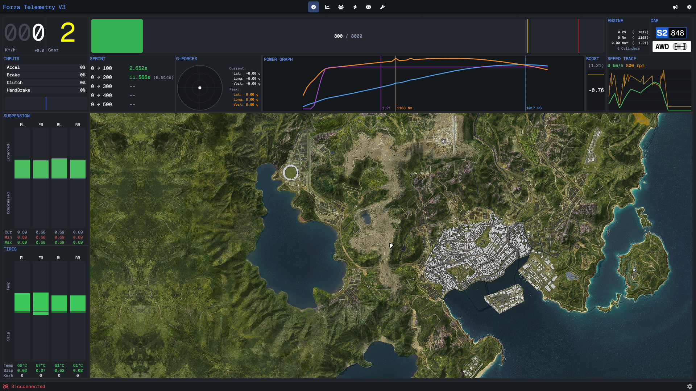
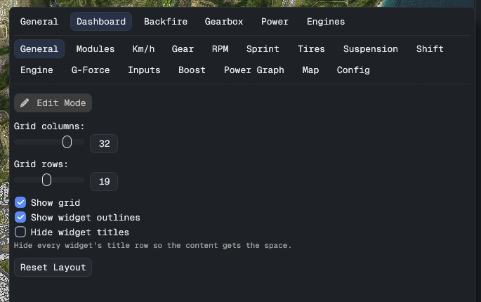
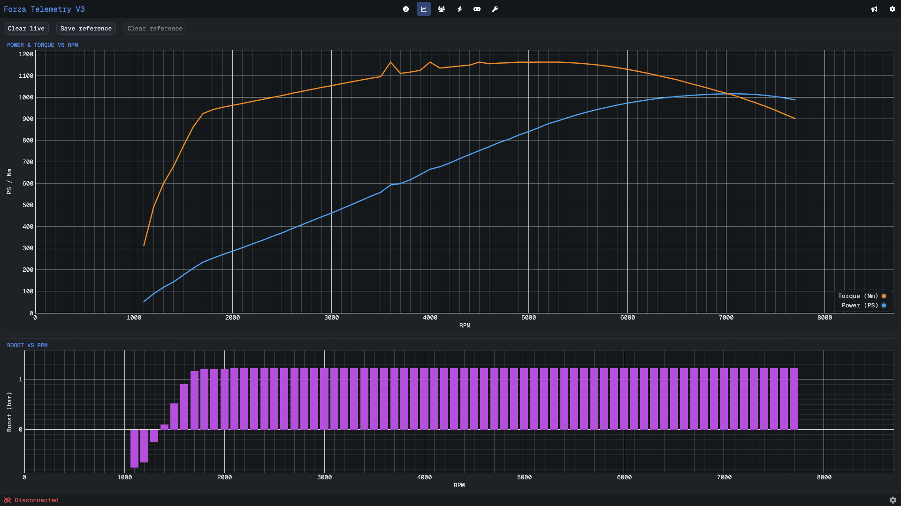
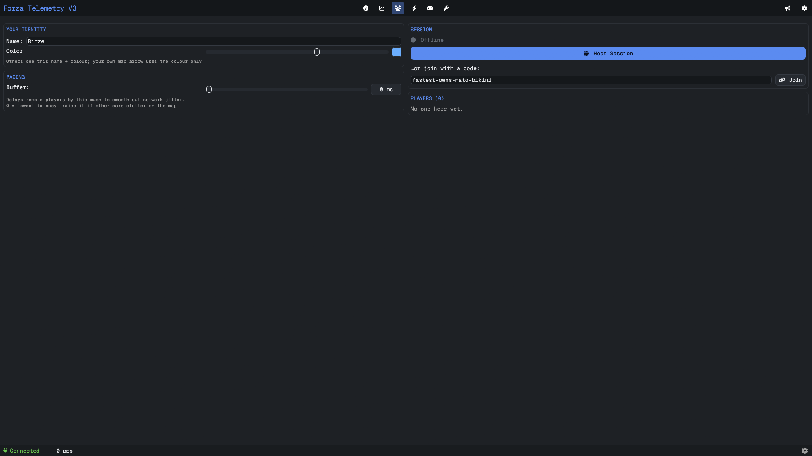
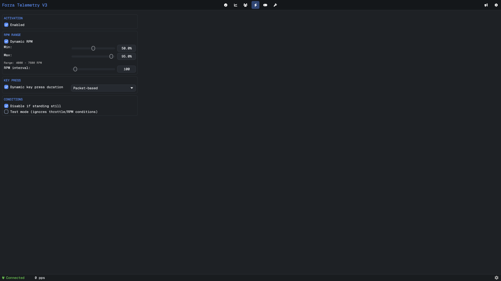
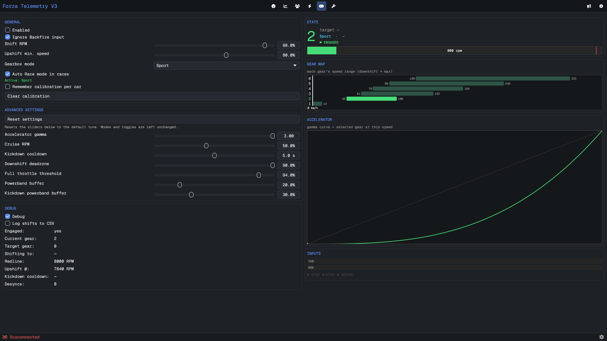
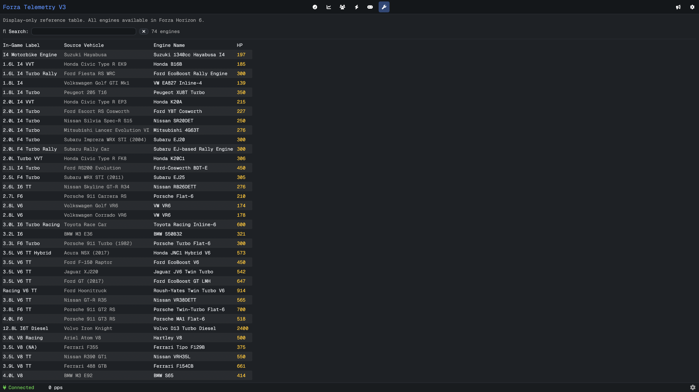

# 🏁 Forza Telemetry V3

A live dashboard for **Forza Horizon 6**. Flip one switch in the game and watch your car's
every move in real time — speed, power, tyres, a live map of the world, and a whole lot more.

> No mods, nothing to install inside the game. Everything you see is built from the data
> Forza sends out while you drive. Just turn it on — see [Getting started](#-getting-started).

---

## 🎛️ Dashboard

The heart of the app: a grid of live tiles — speed, gear, RPM, pedal inputs, tyre
temperatures, suspension, G-forces, a boost gauge, a power graph, and a satellite **map
showing exactly where you are** in the world.

Drag tiles around, resize them, hide the ones you don't care about. Make it look however
you like.

### 🔧 Make it yours — Mini Settings

This is where Forza Telemetry V3 really shines. Behind the little **cog** hides a settings
panel for *everything* — every tile, every colour, every readout has its own options. Grid
size, units, what's shown and what's hidden… tune it once and the dashboard is truly yours.

---

## 📈 Power Curve

Floor it in a straight line and your **power and torque curves draw themselves** as the revs
climb. Save one as a reference, change a part or a tune, and instantly see the difference.

---

## 👥 Co-Op

Drive together. **Host a session**, share the simple code it hands you (something like
`fastest-owns-nato-bikini`), and everyone shows up live on each other's map — names, colours
and trails included. No accounts, no fiddly setup.

---

## 🔥 Backfire

Pops, bangs and anti-lag on the overrun. Pick when it fires (by RPM) and how punchy it is.

---

## ⚙️ Automatic Gearbox

A smart auto-shifter that changes gears for you — choose **Street**, **Sport** or **Race**,
and it learns each car so the shifts land right where you want them.

---

## 🔎 Engine Swaps

A quick reference of every engine swap in Forza Horizon 6 — what it is, which car it comes
from, and how much power it makes. Search and browse.

---

## 🚦 Getting started

**Easiest way to install:** grab the **[Forza Telemetry V3 Launcher](https://github.com/Ritze03/ForzaTelemetryV3Launcher)**.
It downloads the app for you and **keeps it up to date automatically** — one click and
you're always on the latest version.

Then, to feed it data:

1. In Forza Horizon 6, open **Settings → HUD and Gameplay → Data Out**.
2. Turn it **On**.
3. Enter the IP address and port shown in Forza Telemetry V3.
4. Start driving — the dashboard comes alive. 🏎️

---

Curious about the internals? Full technical documentation lives in <a href="docs/README.md"><code>docs/</code></a>.
